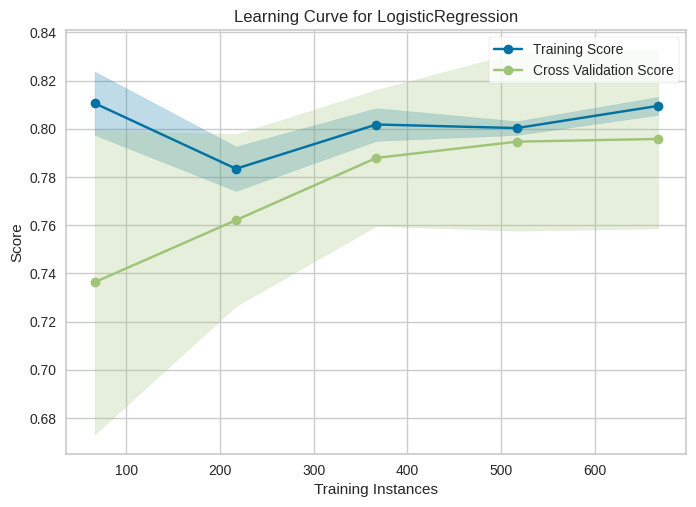
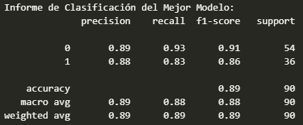
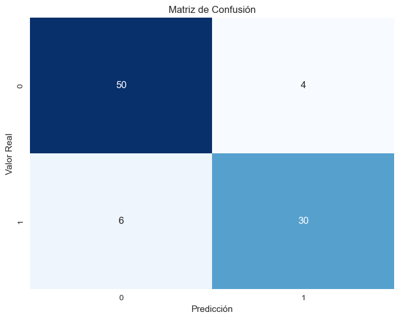

## Regresión logística

**Regresión Logística: Resumen**

La regresión logística es un método estadístico utilizado principalmente para problemas de clasificación binaria, es decir, cuando quieres predecir si un evento o resultado pertenece a una de dos categorías, como sí/no, 1/0, o positivo/negativo. Aunque el nombre contiene la palabra "regresión", en realidad se trata de un algoritmo de clasificación.

**Cómo funciona:**

1. **Definición de variables independientes:** Comienza reuniendo datos y definiendo tus variables independientes (predictoras) y la variable dependiente (la que quieres predecir o clasificar). Por ejemplo, si deseas predecir si un estudiante aprobará o no un examen, las variables independientes podrían ser horas de estudio y calificaciones previas, y la variable dependiente sería si el estudiante aprobó (1) o no (0).

2. **Transformación logística:** La regresión logística utiliza una función logística (también conocida como función sigmoide) para transformar la combinación lineal de las variables independientes en un valor entre 0 y 1, que se interpreta como la probabilidad de que el resultado pertenezca a la categoría positiva (1). La función logística tiene la forma:

   $\[P(Y=1) = \frac{1}{1 + e^{-(b_0 + b_1X_1 + b_2X_2 + \ldots + b_nX_n)}}\]$

   Donde:
   - $\(P(Y=1)\)$ es la probabilidad de que el resultado sea 1.
   - $\(b_0, b_1, b_2, \ldots, b_n\)$ son los coeficientes de la regresión que se ajustan durante el entrenamiento.
   - $\(X_1, X_2, \ldots, X_n\)$ son los valores de las variables independientes.

3. **Entrenamiento del modelo:** El objetivo es encontrar los mejores valores para los coeficientes $\(b_0, b_1, b_2, \ldots, b_n\)$ que minimicen el error en las predicciones. Esto se hace mediante técnicas de optimización, como la maximización de la verosimilitud.

4. **Umbral de decisión:** Para realizar una clasificación, debes definir un umbral de decisión, típicamente 0.5. Si la probabilidad predicha es mayor que el umbral, clasificas el resultado como 1; de lo contrario, lo clasificas como 0.

5. **Evaluación del modelo:** Para evaluar qué tan bien funciona el modelo, se utilizan métricas como precisión, exhaustividad, F1-score y la curva ROC, entre otras.

6. **Predicciones:** Con el modelo entrenado y evaluado, puedes usarlo para hacer predicciones en nuevos datos desconocidos.

En resumen, la regresión logística es una técnica de aprendizaje supervisado que se utiliza para problemas de clasificación binaria. Transforma la combinación lineal de las variables independientes en una probabilidad utilizando una función logística y ajusta los coeficientes para hacer predicciones y tomar decisiones de clasificación.

## Dataset del Titanic

*Nombre del Conjunto de Datos:* Titanic: Machine Learning from Disaster

*Descripción:*
Este conjunto de datos es uno de los conjuntos de datos más populares en la comunidad de aprendizaje automático. Contiene información sobre los pasajeros del famoso barco Titanic, incluyendo si sobrevivieron o no al naufragio. El conjunto de datos se utiliza comúnmente para tareas de aprendizaje automático de clasificación, donde el objetivo es predecir si un pasajero sobrevivió o no en función de diversas características.

*Cantidad de registros/muestras:* El conjunto de datos del Titanic incluye alrededor de 1309 registros o muestras entre train y test. Estos registros representan a los pasajeros que estaban a bordo del Titanic en su viaje inaugural.

*El conjunto de datos incluye las siguientes columnas (variables):*

- *PassengerId:* Identificación única del pasajero.
- *Survived:* Variable objetivo (0 = No sobrevivió, 1 = Sobrevivió).
- *Pclass:* Clase del billete (1 = Primera clase, 2 = Segunda clase, 3 = Tercera clase).
- *Name:* Nombre del pasajero.
- *Sex:* Género del pasajero.
- *Age:* Edad del pasajero.
- *SibSp:* Cantidad de hermanos/cónyuges a bordo.
- *Parch:* Cantidad de padres/hijos a bordo.
- *Ticket:* Número de boleto.
- *Fare:* Tarifa del billete.
- *Cabin:* Número de cabina.
- *Embarked:* Puerto de embarque (C = Cherbourg, Q = Queenstown, S = Southampton).

Número de clases de salida: En el contexto del conjunto de datos del Titanic, el objetivo típico es predecir si un pasajero sobrevivió o no al naufragio. Por lo tanto, hay dos clases de salida:

- *Survived:* Esta variable toma dos valores: 0 si el pasajero no sobrevivió y 1 si el pasajero sobrevivió.

URL del Conjunto de Datos en Kaggle:
Puedes acceder al conjunto de datos del Titanic en Kaggle a través de la siguiente URL: [Titanic: Machine Learning from Disaster](https://www.kaggle.com/competitions/titanic)

## Elección de Implementación:
Opté por utilizar la implementación de regresión logística de scikit-learn en lugar de crear una desde cero debido a su eficiencia y capacidad para obtener resultados sólidos en menos tiempo. Los resultados obtenidos con esta implementación fueron prometedores, alcanzando una precisión del 0.88. La curva de aprendizaje muestra un buen rendimiento, los coeficientes son coherentes y significativos. Dado que este modelo es relativamente simple, pudimos dedicar tiempo y esfuerzo para ajustar los hiperparámetros y mejorar aún más los resultados.

## Separación y Evaluación de Datos:
Dividimos nuestros datos en conjuntos de entrenamiento (train) y prueba (test) utilizando una división de 90/10 de forma aleatoria, utilizando un valor de random state igual a 42 para asegurar la reproducibilidad. Esta división nos permitió evaluar el modelo de manera efectiva y ajustar los hiperparámetros.

### Diagnóstico y explicación el grado de bias o sesgo: bajo medio alto

En esta grafica se puede ver que conforme aumenta el tamaño del conjunto de entrenamiento, el rendimiento en el conjunto de prueba también mejora. Esta convergencia gradual entre el rendimiento en el conjunto de entrenamiento y el conjunto de prueba es una señal muy positiva. Muestra que el modelo no solo se está ajustando a los datos de entrenamiento (lo que podría indicar sobreajuste o alto sesgo), sino que también está generalizando bien a datos nuevos y no vistos. 

### Diagnóstico y explicación el grado de varianza: bajo medio alto

En las metricas de evaluacion de nuestro modelo al realizar el refinamiento pudimos ver una mejora en las metricas de este, por lo que, podemos decir que el grado de varianza es bajo, ya que, el modelo no esta sobreajustado a los datos de entrenamiento y generaliza bien a datos nuevos y no vistos. Cosa que confirma la grafica de la curva de aprendizaje y la matriz de confusion.

En la matriz de confusion podemos ver que igualmente se presenta una varianza del modelo baja, esto debido a que los valores de la diagonal son los mas altos y los que estan fuera de la diagonal son los mas bajos, lo que nos indica que el modelo esta prediciendo bien los valores de la clase 0 y 1 y no hay un sobreajuste o subajuste de los datos que nos aumente la varianza del modelo.

Las curvas de entrenamiento y validación están convergiendo y son cercanas entre sí, es probable que el modelo tenga una baja varianza. Si están muy separadas, el modelo puede estar sobreajustando pero nosotros estamos en el caso contratio.

## Diagnóstico del Ajuste del Modelo:

Para evaluar el ajuste del modelo, analizamos la curva de aprendizaje. Observamos que los conjuntos de entrenamiento y validación comienzan a separarse y luego convergen, lo que es un buen indicador de que el modelo se está ajustando correctamente. No se observa subajuste (underfitting) ni sobreajuste (overfitting).

## Optimización de Hiperparámetros:
Utilizamos el framework Optuna para mejorar iterativamente la métrica de precisión (accuracy) del modelo. A través de esta optimización, logramos mejorar la métrica de precisión hasta alcanzar un valor de 0.88, lo que indica una mejora sustancial en el rendimiento del modelo.

En resumen, la implementación de regresión logística utilizando scikit-learn ha demostrado ser efectiva en este conjunto de datos. Identificamos y abordamos problemas de sesgo y alta varianza, y logramos un ajuste adecuado del modelo mediante la optimización de hiperparámetros. Los resultados son prometedores y respaldados por indicadores claros y gráficas comparativas en nuestro informe.

## Explica como la solución cumple leyes, normas y principios éticos, de la industria o el ambiente del reto.
La explicación se encuentra en contexto y normatividad.pdf

## Explica en su repositorio cual es la normatividad correspondiente del reto o socio formador.
La explicación se encuentra en contexto y normatividad.pdf